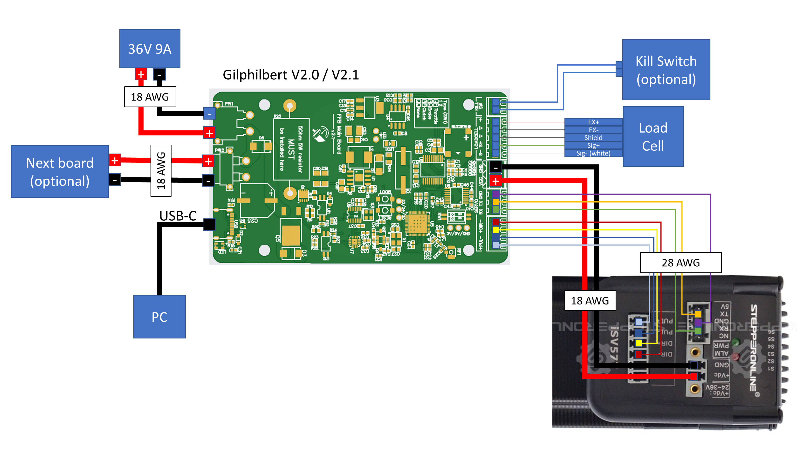
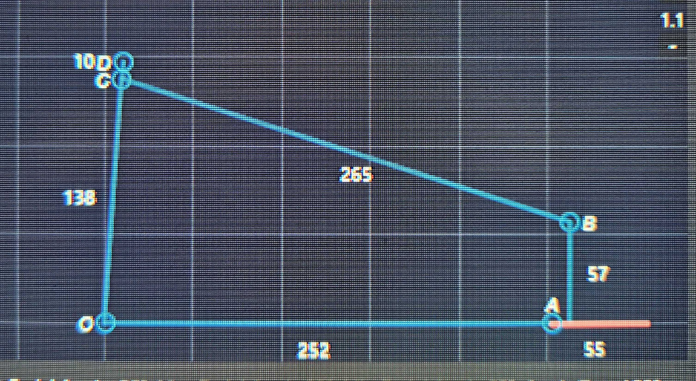

# Building DIY FFB Pedals
Over at [DIY-Sim-Racing-FFB-Pedal](https://github.com/ChrGri/DIY-Sim-Racing-FFB-Pedal) a fine group of people desgined the mechanics, electronics, and [SimHub](https://www.simhubdash.com/) integrations for a force feedback enabled sim racing pedal.

The main contact points for the project are their [git](https://github.com/ChrGri/DIY-Sim-Racing-FFB-Pedal), [Wiki](https://github.com/ChrGri/DIY-Sim-Racing-FFB-Pedal/wiki) and [Discord](https://discord.gg/zTfQaxpAUz).
Make sure to read the wiki first!

# Content

1) [Gathering all the parts](#gathering)
1) [Building the pedals](#building)
1) [Wiring](#wiring)
1) [Setup](#setup)
1) [Enjoy](#enjoy)

<a name="gathering"/>
# Gathering all the parts

## StepperOnline
Servo: NEMA 23 Integrated Easy Servo Motor 130W 3000rpm 0.45Nm 20-50VDC Servo Motor - Short Shaft (iSV57T-130S); also include the USB 2.0 to Serial RS232 Adapter with 1m Cable Converter in your order to be prepared
Power:LRS-350-36 MEANWELL 350W 36VDC 9.7A 115/230VAC Enclosed Switching Power Supply

## Discord group orders
From time to time, people ask to join group orders to keep everything affordable. Don´t hesitate to ask there! I joined a batch order for the boards and mechanics.

Board: [Gilphilbert v2.1](https://github.com/gilphilbert/DIY-Sim-Racing-FFB-Pedal-PCBs)
Mechanics: [Full Carbon Fiber & Aluminium set](https://discord.com/channels/1113129142142120159/1326376712455323658), also see their [git](https://github.com/Simdesign-Race/DIY-Carbon-Aluminium-Active-Pedals).

## AliExpress
Load Cell: DYLY-107, 200kg

## JLC
Rails: JKK60-5-P-150-A1-F4-M
Additionals: BEUP-K-D8 (for mounting the pedal loadcell rail connectors, no longer relevant with DIY-Carbon-Aluminium-Active-Pedals v2)
Also recommend to add all screws, nuts, shims, and wheelbearings to your order here! Check the [BOM](https://github.com/Simdesign-Race/DIY-Carbon-Aluminium-Active-Pedals/wiki/BOM) of the Full Carbon Fiber & Aluminium if you go with them.

## Amazon
Antenna: [2.4GHz 5GHz 5.8GHz Dual Band WiFi RP-SMA Antenna + 2 x 21 cm U.FL/IPEX](https://www.amazon.de/dp/B09K41BDYL) (U\.FL seems to be IPEX-1)
Wireless Bridge: [Waveshare ESP32-S3-DEV-KIT-N16R8](https://www.amazon.de/dp/B0DLWGVXCS)

I had a hard time finding the correct serial connectors for the servo. In the end, I went with [3P 2EDGRK 2.54 mm Weld-Free Cable Clamp, Pluggable Quick Male and Female Connector for 26-18AWG](https://www.amazon.de/dp/B0FB8TRYFM), removing the little guides which were misaligned.

<a name="building"/>
# Building the pedals

Assembling of the pedals is straight forward. Be sure to properly tighten the servo-rail connectors and have the 3D printed parts ready when you need them.

I mounted the pedals on 30x30 alu profiles with the power supply below and the boards mounted between the pedals.

A proper enclosing will follow.

<a name="wiring"/>
# Wiring
The gilphilbert board features power in and power out, so connecting a second pedal requires a short cable only. In contrast to what I am used to, TX board goes to TX on the servo, RX board goes to RX on the servo. Seems to be a often made mistake, so make sure to connect it correctly!

<a name="setup"/>
# Setup

Initially, I wanted to have USB connection to the pedal control boards as I did not want to have even more wireless stuff around. But after issues (apprupt disconnect from the SimHub Bridge Arduino), I resorted to the wireless bridge as recommended when asking in the Discord.

Here are the pedal kinematics for set up in the SimHub plugin to give accurate force calculations. 

<a name="enjoy"/>
# Enjoy
Drive and enjoy the configurability offered by the plugin and SimHub!